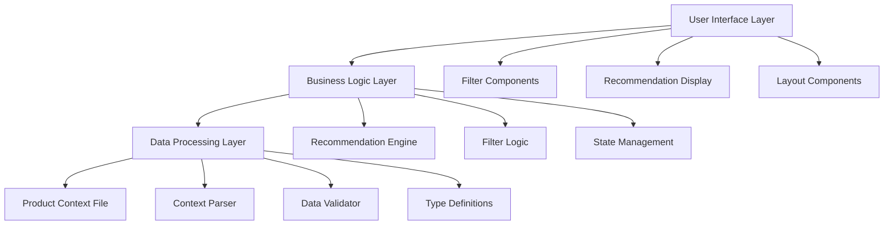

# Design Document

## Overview

The Local Street Food Recommender is a React TypeScript frontend application that provides personalized street food recommendations based on user preferences. The system processes a structured product.md context file containing localized street food data and implements intelligent filtering to match user selections for area, time of day, and audience type.

The application follows a component-based architecture with clear separation between data processing, business logic, and presentation layers. It emphasizes performance, user experience, and maintainability while remaining frontend-only without requiring backend services.

## Architecture

### High-Level Architecture



### Project Structure

```
src/
├── components/           # Reusable UI components
│   ├── filters/         # Filter-related components
│   ├── recommendations/ # Recommendation display components
│   └── common/          # Shared UI components
├── hooks/               # Custom React hooks
├── services/            # Business logic and data processing
├── types/               # TypeScript type definitions
├── utils/               # Utility functions
├── data/                # Static data and context files
└── styles/              # CSS modules and styling
```

## Components and Interfaces

### Core Components

#### FilterPanel Component
- **Purpose**: Manages user preference selection
- **Props**: `onFiltersChange: (filters: FilterCriteria) => void`
- **State**: Current filter selections
- **Responsibilities**: 
  - Render area, time, and audience type selectors
  - Validate user selections
  - Emit filter changes to parent component

#### RecommendationList Component
- **Purpose**: Displays filtered food recommendations
- **Props**: `recommendations: FoodItem[], loading: boolean`
- **Responsibilities**:
  - Render food items in organized layout
  - Handle empty states and loading indicators
  - Provide detailed food information display

#### FoodCard Component
- **Purpose**: Individual food item display
- **Props**: `foodItem: FoodItem`
- **Responsibilities**:
  - Show food name, area, price, timing
  - Display vibe, must-try suggestions, and notes
  - Maintain consistent visual presentation

### Custom Hooks

#### useRecommendations Hook
```typescript
interface UseRecommendationsReturn {
  recommendations: FoodItem[];
  loading: boolean;
  error: string | null;
  applyFilters: (filters: FilterCriteria) => void;
}
```

#### useProductContext Hook
```typescript
interface UseProductContextReturn {
  foodItems: FoodItem[];
  areas: string[];
  audienceTypes: string[];
  loading: boolean;
  error: string | null;
}
```

## Data Models

### Core Data Types

```typescript
interface FoodItem {
  id: string;
  name: string;
  area: string;
  audienceTypes: string[];
  priceRange: PriceRange;
  timeSlots: TimeSlot[];
  vibe: string;
  mustTry: string;
  notes: string;
}

interface FilterCriteria {
  area?: string;
  timeOfDay?: TimeSlot;
  audienceType?: string;
}

enum PriceRange {
  LOW = 'Low',
  MEDIUM = 'Medium',
  HIGH = 'High'
}

enum TimeSlot {
  MORNING = 'Morning',
  AFTERNOON = 'Afternoon', 
  EVENING = 'Evening',
  LATE_NIGHT = 'Late Night',
  MIDNIGHT = 'Midnight'
}

interface ProductContext {
  areas: AreaData[];
}

interface AreaData {
  name: string;
  foods: FoodItem[];
}
```

### Data Schema for product.md

The product.md file follows this structured format:

```
Area: [Area Name]
Foods:

Name: [Food Name]
Audience: [Comma-separated audience types]
Price: [Low/Medium/High]
Time: [Time periods when available]
Vibe: [Atmosphere description]
MustTry: [Special recommendations]
Notes: [Cultural insights and tips]
```

## Correctness Properties

*A property is a characteristic or behavior that should hold true across all valid executions of a system-essentially, a formal statement about what the system should do. Properties serve as the bridge between human-readable specifications and machine-verifiable correctness guarantees.*

### Property Reflection

After analyzing all acceptance criteria, several properties can be consolidated to eliminate redundancy:
- Area, time, and audience validation properties (1.2, 1.4, 1.3) can be combined into a comprehensive input validation property
- Filtering properties (3.2, 3.3, 3.4) can be combined into a single comprehensive filtering accuracy property  
- UI display properties (4.1, 4.2) can be combined into a comprehensive information display property
- Data validation properties (5.2, 5.3, 5.4, 5.5) can be combined into a comprehensive data schema compliance property

### Core Properties

**Property 1: Input Validation Completeness**
*For any* user selection (area, time period, or audience type), the system should validate the selection against available options in the product context and accept only valid selections
**Validates: Requirements 1.2, 1.3, 1.4**

**Property 2: UI Reactivity**
*For any* change to user filter selections, the system should immediately update the available options and recommendations without requiring manual refresh
**Validates: Requirements 1.5**

**Property 3: Context Parsing Round-Trip**
*For any* valid product context data, parsing then serializing should preserve all original information including area, name, audience types, price range, time slots, vibe, and notes
**Validates: Requirements 2.1, 2.2, 2.5**

**Property 4: Comma-Separated Value Parsing**
*For any* food item with comma-separated audience types, the parser should correctly extract each individual audience type as a separate array element
**Validates: Requirements 2.3**

**Property 5: Error Resilience**
*For any* product context containing malformed entries mixed with valid entries, the system should log errors for malformed data while successfully processing all valid entries
**Validates: Requirements 2.4**

**Property 6: Filtering Accuracy**
*For any* complete filter criteria (area, time, audience), all returned recommendations should match every specified filter criterion
**Validates: Requirements 3.1, 3.2, 3.3, 3.4**

**Property 7: Fallback Recommendations**
*For any* filter combination that produces no exact matches, the system should provide partial matches or alternative suggestions rather than empty results
**Validates: Requirements 3.5**

**Property 8: Result Ordering Consistency**
*For any* set of multiple matching recommendations, the system should present them in a consistent, deterministic order based on defined criteria
**Validates: Requirements 3.6**

**Property 9: Information Display Completeness**
*For any* food recommendation displayed to the user, all required information fields (name, area, price, timing, audience, vibe, must-try, notes) should be present and visible
**Validates: Requirements 4.1, 4.2**

**Property 10: Must-Try Highlighting**
*For any* food item with must-try suggestions, the UI should visually distinguish these recommendations from regular information
**Validates: Requirements 4.3**

**Property 11: Data Schema Compliance**
*For any* food item in the product context, it should contain all required fields (name, audience, price, time, vibe, must-try, notes) with values conforming to standardized formats
**Validates: Requirements 5.1, 5.2, 5.3, 5.4, 5.5**

**Property 12: UI State Management**
*For any* application state (incomplete selections, loading, empty results), the UI should provide appropriate feedback, guidance, or indicators
**Validates: Requirements 6.2, 6.3, 6.4**

<function_calls>
<invoke name="prework">
<parameter name="featureName">street-food-recommender

## Error Handling

### Input Validation Errors
- **Invalid Area Selection**: Display error message and reset to default state
- **Invalid Time Period**: Show available time options and guide user selection
- **Invalid Audience Type**: Provide list of valid audience categories

### Data Processing Errors
- **Malformed Product Context**: Log specific parsing errors while continuing with valid data
- **Missing Required Fields**: Skip incomplete food items and log warnings
- **Invalid Data Types**: Apply default values where possible, log inconsistencies

### Runtime Errors
- **Filter Processing Failures**: Fall back to showing all available options
- **Recommendation Generation Errors**: Display error message with retry option
- **UI Component Errors**: Use error boundaries to prevent application crashes

### Error Recovery Strategies
- **Graceful Degradation**: Continue operation with reduced functionality when possible
- **User Feedback**: Provide clear, actionable error messages
- **Logging**: Capture errors for debugging while maintaining user experience

## Testing Strategy

### Dual Testing Approach

The application will use both unit testing and property-based testing to ensure comprehensive coverage:

**Unit Tests**: Focus on specific examples, edge cases, and error conditions
- Component rendering with specific props
- User interaction scenarios
- Error boundary behavior
- Integration between components

**Property Tests**: Verify universal properties across all inputs
- Input validation across all possible selections
- Filtering accuracy with randomized data sets
- Data parsing with various context formats
- UI state management across different scenarios

### Property-Based Testing Configuration

**Testing Framework**: We will use `fast-check` for property-based testing in TypeScript/React
- Minimum 100 iterations per property test to ensure thorough coverage
- Each property test will reference its corresponding design document property
- Tag format: **Feature: street-food-recommender, Property {number}: {property_text}**

**Test Organization**:
- Property tests will be co-located with unit tests using `.test.ts` suffix
- Each correctness property will be implemented as a single property-based test
- Tests will use smart generators that constrain inputs to valid ranges
- Mock data generators will create realistic food item and filter combinations

### Testing Coverage Requirements

**Core Functionality Tests**:
- Product context parsing and validation
- Filter application and recommendation generation
- UI component rendering and interaction
- Error handling and recovery scenarios

**Performance Considerations**:
- Filter performance with large datasets
- UI responsiveness during recommendation updates
- Memory usage during context parsing

**Cross-Browser Compatibility**:
- Component behavior across modern browsers
- Responsive design validation
- Accessibility compliance testing